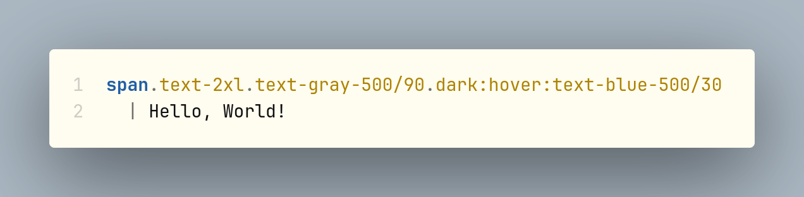
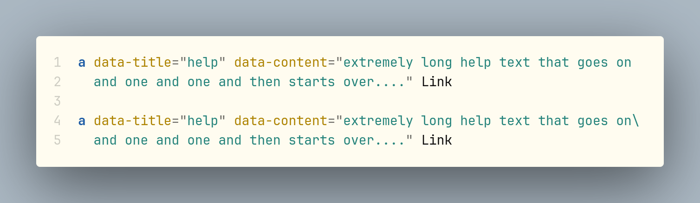
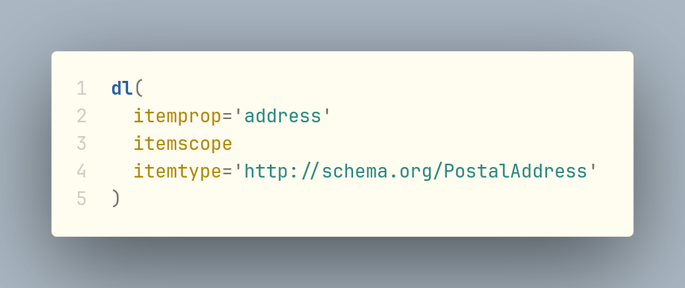
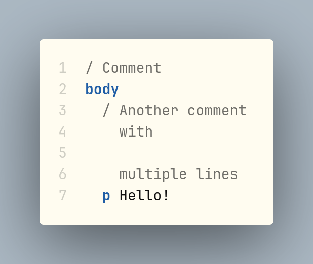
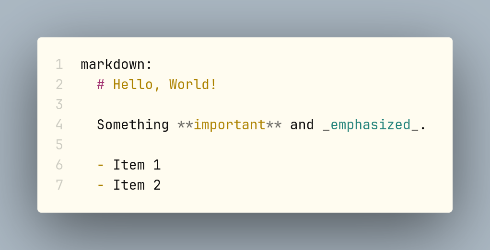
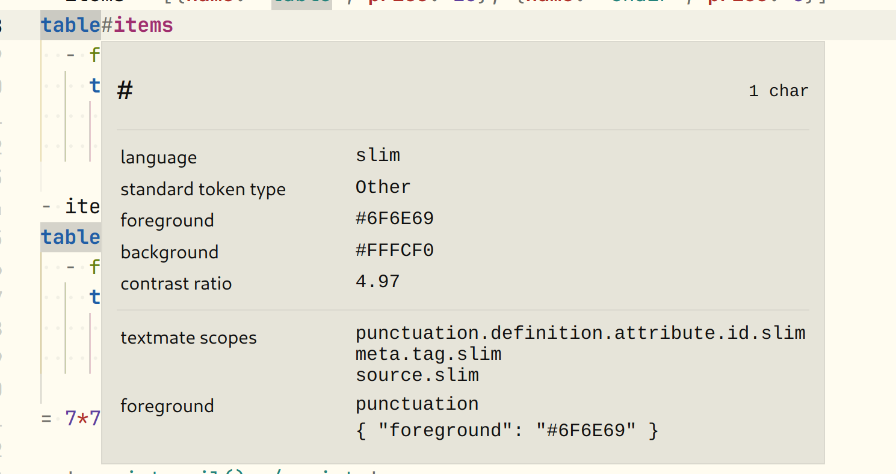

# Slim syntax highlighting for VSCode

The **Ruby Slim** extension brings [Slim template language](https://github.com/slim-template/slim) support to VSCode.
As a complete rewrite of the [Slim extension](https://marketplace.visualstudio.com/items?itemName=sianglim.slim)
by Siang Lim it fixes its issues, aims to support more modern features such as
[Tailwind CSS](https://tailwindcss.com) and is well tested.

## Features

- A more complete [Tailwind CSS](https://tailwindcss.com) support, including:

  - [breakpoint prefixes](https://tailwindcss.com/docs/responsive-design) in class shortcuts (`.sm:text-center`)

  - [modifiers](https://tailwindcss.com/docs/responsive-design) in class shortcuts, even multiple ones (`.hover:dark:text-white`)

  - [opacity modifiers](https://tailwindcss.com/docs/text-color#changing-the-opacity) (`text-blue-600/50`)

  

- Multiline attribute values:

  

- Multiline attributes wrapping:

  

- Multiline comments:

  

- Embedded languages: Ruby, JavaScript, Markdown, ERB, CSS, CoffeeScript, Sass, Less:

  

- More precise [scopes](https://macromates.com/manual/en/language_grammars#naming_conventions) for highlighting

  

- Developer goodies:
  - Full tests coverage
  - Grammar in a human-friendly format (YAML instead of JSON)

## Known Issues

- [Arbitrary values](https://tailwindcss.com/docs/adding-custom-styles#using-arbitrary-values) in class shortcuts (`.top-[117px]`) are
  [not supported](https://github.com/slim-template/slim/issues/906) by Slim and this extension.

- Multiline ruby expressions in HTML attribute values are not supported (this would probably require [semantic
  highlighting](https://code.visualstudio.com/api/language-extensions/semantic-highlight-guide) / LSP).

## Release Notes

See the [Changelog](https://github.com/borama/vscode-ruby-slim/blob/main/CHANGELOG.md).

## Contributing

Please file an [Issue](https://github.com/borama/vscode-ruby-slim/issues) or [Pull Request](https://github.com/borama/vscode-ruby-slim/pulls) on the [GitHub repository](https://github.com/borama/vscode-ruby-slim)

## Helpful links / Acknowledgements

- [My blog post about creating this extension]TBD
- [Syntax Highlighting Guide](https://code.visualstudio.com/api/language-extensions/syntax-highlight-guide) - official guide from the VSCode team
- [SublimeText Slim 2.0 grammar](https://github.com/SublimeText/Slim/blob/master/Syntaxes/Slim.sublime-syntax) - this extension gets a lot of inspiration from this SublimeText grammar
- [Writing a TextMate Grammar: Some Lessons Learned](https://www.apeth.com/nonblog/stories/textmatebundle.html) - an older resource but still one of the best
- [Rubular](https://rubular.com/) is your best friend here
- as is a [good regexp manual](https://www.regextutorial.org)
- the [Slim extension](https://marketplace.visualstudio.com/items?itemName=sianglim.slim)
by Siang Lim that this one builds on
- the [vscode-ruby-lsp](https://github.com/Shopify/vscode-ruby-lsp) project has some nice Ruby/ERB [grammars](https://github.com/Shopify/vscode-ruby-lsp/tree/main/grammars)
